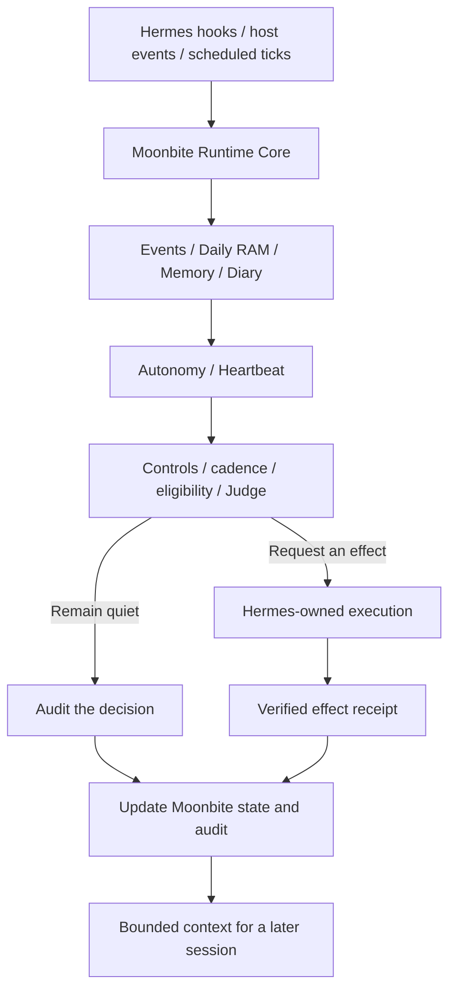

# Moonbite

> **Let AI persist in its own way.**

Moonbite is a persistent runtime for long-running agents. It gives agents
durable memory, daily working state, host-triggered autonomous activities,
heartbeat decisions, runtime controls, and auditable effects.

Moonbite is an experimental project. Its first priority is to communicate a
design philosophy and explore how that philosophy might work in practice.

[](LICENSE)
[](pyproject.toml)
[](COMPATIBILITY.md)
[](#project-status)

[简体中文](README.zh-CN.md)

## Public Preview Scope

Supported in this preview:

- Hermes Agent as the only supported host adapter
- Source installation pinned to an immutable commit SHA
- Linux, WSL2 on a native Linux filesystem, and macOS
- Runtime Core, Heartbeat, Autonomy, Daily RAM / Panel, Memory / Diary,
  controls, effects, and audit
- Host-owned scheduling, model routes, credentials, network acquisition,
  gateways, and delivery

Not provided in this preview:

- PyPI or other package distribution
- A stable public Python API guarantee
- Support for non-Hermes harnesses
- Production support or long-term compatibility guarantees
- An internal scheduler, credential store, network browser, or messaging channel

No Moonbite package is published for this preview. Install from source through
Hermes and pin an immutable commit SHA.

## Why long-running agents need Moonbite

Most agent systems optimize for one prompt or one session. An agent that remains
responsible for a relationship, a system, or a queue needs to carry state
forward, decide when to act or remain quiet, and preserve evidence across
sessions and days.

Moonbite adds that time dimension without replacing the host agent. It keeps
persistence semantics and decision gates explicit, while the host retains
control of models, tools, credentials, scheduling, and delivery.

## How Moonbite works



- Hermes owns ticks, model routes, credentials, tools, gateways, and delivery.
- Moonbite owns persistence semantics, decision gates, state transitions, and
  receipt matching.
- A model statement is not proof of delivery.
- Remaining quiet is a valid audited result.

## Runtime primitives

- **Runtime Core** normalizes events and keeps append-only event, audit,
  control, and cadence ledgers.
- **Heartbeat** evaluates whether a host-submitted candidate should act,
  escalate, or remain quiet. It is a decision pipeline, not a timer.
- **Autonomy** selects at most one eligible host-triggered activity per tick and
  records its terminal result without rerolling failures.
- **Daily RAM / Panel** keeps bounded working state, daily rollover, and
  verified activity Afterglow.
- **Memory / Diary** preserves provenance-backed cards, exact evidence access,
  append-only maintenance history, and grounded daily synthesis.
- **Controls, effects, and receipts** provide pause, quota, cadence, safety
  gates, and proof that a requested effect was actually accepted or completed.

## Host boundary and inert defaults

Moonbite does not include a scheduler, daemon, credential store, network
browser, model router, or messaging transport. The Hermes adapter registers
exactly 10 tools and 5 lifecycle hooks; the exact surfaces are documented in
[SETUP.md](SETUP.md) and [plugin.yaml](plugin.yaml).

The hooks are `pre_gateway_dispatch`, `on_session_start`, `pre_llm_call`,
`post_llm_call`, and `on_session_finalize`.

With the default configuration:

- only `runtime_core` is enabled;
- `heartbeat`, `autonomy`, `panel`, and `memory` are disabled;
- delivery uses the `noop` adapter;
- model routes are unconfigured;
- installation alone starts no background task, model call, network request, or
  external message.

Every visible effect requires a matching host receipt. Disabling or uninstalling
Moonbite does not delete its state directory.

## Hermes-only source installation

Install a reviewed full 40-character commit in a disabled state:

```bash
hermes plugins install beniedev/moonbite \
  --ref "<40-character-commit-sha>" \
  --no-enable
```

Then inspect any installer security findings, run the manifest doctor, merge an
owner-reviewed configuration, and enable the plugin only when ready:

```bash
hermes plugins doctor moonbite --ci
hermes plugins enable moonbite --no-allow-tool-override
```

Do not install a floating `main` branch as a stable target. See
[SETUP.md](SETUP.md) for the complete isolated setup, consent, restart, and
rollback procedure.

## Verification, doctor, and rollback

After starting a fresh Hermes process:

```bash
hermes moonbite doctor
hermes moonbite status
```

The doctor is side-effect-free: it performs no model call, network probe, or
state write. A safe inert result reports `ok: true`,
`network_probe: "not_performed"`, `writes_performed: false`, and
`delivery_adapter: "noop"`.

To stop code loading, run `hermes plugins disable moonbite`. To remove the
installed checkout, run `hermes plugins remove moonbite`. Neither command
deletes Moonbite state; retention and physical deletion remain host-owned.

## Experimental surfaces

The repository includes an experimental, host-neutral Panel API for design
exploration and future adapters. It is tested but is not part of the initial
Hermes-only support contract and carries no stable API guarantee.

See [docs/features/PANEL.md](docs/features/PANEL.md).

## Design philosophy and technical references

- [Design philosophy](docs/DESIGN_PHILOSOPHY.md) explains why Moonbite exists.
- [设计理念（简体中文）](docs/DESIGN_PHILOSOPHY.zh-CN.md) is the canonical
  Chinese counterpart.
- [DESIGN.md](DESIGN.md) defines architecture and security boundaries.
- [CONFIGURATION.md](CONFIGURATION.md) documents configuration and presets.
- [COMPATIBILITY.md](COMPATIBILITY.md) records the tested platform and Hermes
  contract.
- [DEPLOYMENT_COMPATIBILITY.md](DEPLOYMENT_COMPATIBILITY.md) defines migration
  expectations for established deployments.
- [SECURITY.md](SECURITY.md) explains vulnerability reporting and release
  privacy gates.
- [CHANGELOG.md](CHANGELOG.md) records unreleased project changes.

## Project status

```text
Status: pre-alpha public source preview
Supported host: Hermes Agent only
Distribution: source install from pinned SHA
Support: best effort
API stability: not guaranteed
```

This preview exposes the design, runtime contracts, and working implementation
early. Interfaces and compatibility may change as the project learns from
careful real-world use.

## License

Moonbite is available under the [MIT License](LICENSE).
