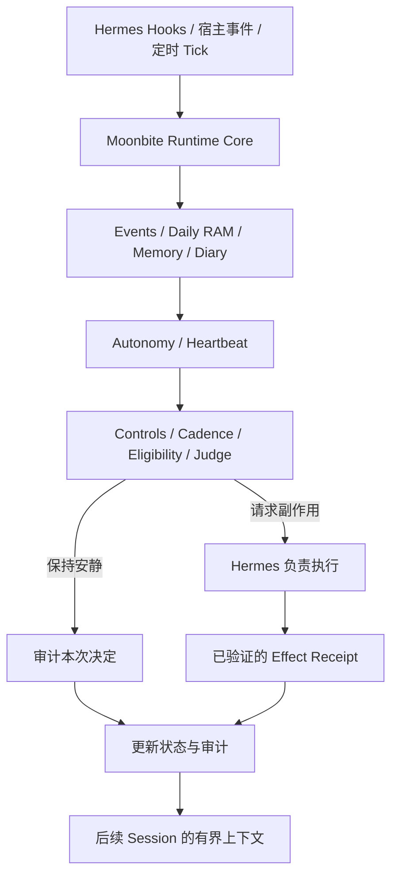

# Moonbite

> **Let AI persist in its own way.**
>
> **让 AI 以自己的方式持续存在。**

Moonbite 是一个面向 long-running agents 的持续性运行时。它为 Agent
提供耐久记忆、每日工作状态、由宿主触发的自主活动、Heartbeat 决策、
运行时控制，以及可审计的真实副作用。

Moonbite 是一项实验性作品：首要目标是传达设计理念，并探索这些理念在
实践中的可能性。

[](LICENSE)
[](pyproject.toml)
[](COMPATIBILITY.md)
[](#项目状态)

[English](README.md)

## Public Preview 范围

本次预览支持：

- Hermes Agent 作为唯一正式支持的 host adapter
- 锁定不可变 Commit SHA 的源码安装
- Linux、使用原生 Linux 文件系统的 WSL2，以及 macOS
- Runtime Core、Heartbeat、Autonomy、Daily RAM / Panel、Memory /
  Diary、运行时控制、副作用与审计
- 由宿主拥有的调度、模型路由、凭据、网络获取、Gateway 与 Delivery

本次预览不提供：

- PyPI 或其他 Package 分发
- 稳定 public Python API 保证
- 非 Hermes harness 支持
- 生产支持或长期兼容性保证
- 内置 scheduler、凭据存储、网络浏览器或消息渠道

本次预览没有发布 Moonbite Package。请通过 Hermes 从源码安装，并锁定
不可变的 Commit SHA。

## 为什么 long-running agents 需要 Moonbite

多数 Agent 系统面向一次 prompt 或一次 session。若一个 Agent 需要持续
对某段关系、某套系统或某个队列负责，他就必须把状态带到未来，判断何时
行动、何时保持安静，并跨 session 和自然日保留证据。

Moonbite 为 Agent 加入这个时间维度，但不取代宿主。Moonbite 明确管理
持续性语义与决策门禁；模型、工具、凭据、调度和真实交付仍由宿主控制。

## Moonbite 如何工作



- Hermes 拥有 Tick、模型路由、凭据、工具、Gateway 与 Delivery。
- Moonbite 拥有持续性语义、决策门禁、状态转换与 Receipt 匹配。
- 模型声称执行过，不等于真实交付已经发生。
- 保持安静是合法且会被审计的结果。

## 运行时原语

- **Runtime Core** 规范化事件，并维护追加写的 Event、Audit、Control 与
  Cadence Ledgers。
- **Heartbeat** 判断宿主提交的候选应当行动、升级还是保持安静。它是
  决策流水线，不是定时器。
- **Autonomy** 每次 Tick 至多选择一项符合条件的宿主触发活动；失败即记录
  终态，不在同一次 Tick 重新抽取。
- **Daily RAM / Panel** 保存有界工作状态、每日滚动与已经验证的活动
  Afterglow。
- **Memory / Diary** 保存带来源的卡片、精确证据读取、追加写维护历史与
  基于证据的每日合成。
- **Controls、Effects 与 Receipts** 提供暂停、配额、节奏、安全门禁，以及
  副作用真实被接受或完成的证明。

## 宿主边界与默认静默

Moonbite 不包含 scheduler、daemon、凭据存储、网络浏览器、模型路由器或
消息 transport。Hermes adapter 精确注册 10 个 Tools 与 5 个生命周期
Hooks；完整接口见 [SETUP.md](SETUP.md) 与 [plugin.yaml](plugin.yaml)。

五个 Hooks 分别是 `pre_gateway_dispatch`、`on_session_start`、
`pre_llm_call`、`post_llm_call` 与 `on_session_finalize`。

默认配置下：

- 仅启用 `runtime_core`；
- `heartbeat`、`autonomy`、`panel` 和 `memory` 均关闭；
- Delivery 使用 `noop` adapter；
- 模型路由未配置；
- 仅安装 Moonbite 不会启动后台任务、调用模型、发起网络请求或发送外部消息。

任何可见副作用都需要匹配的宿主 Receipt。禁用或卸载 Moonbite 不会删除其
状态目录。

## 仅限 Hermes 的源码安装

请以禁用状态安装经过审核的完整 40 位 Commit：

```bash
hermes plugins install beniedev/moonbite \
  --ref "<40-character-commit-sha>" \
  --no-enable
```

随后审查安装器的安全 findings、运行 Manifest Doctor、合并经 owner 审核的
配置，并在准备完成后启用：

```bash
hermes plugins doctor moonbite --ci
hermes plugins enable moonbite --no-allow-tool-override
```

不要把浮动的 `main` 分支当作稳定目标安装。完整的隔离安装、授权、重启与
回滚流程见 [SETUP.md](SETUP.md)。

## 验证、Doctor 与回滚

启动新的 Hermes 进程后运行：

```bash
hermes moonbite doctor
hermes moonbite status
```

Doctor 是无副作用检查：不调用模型、不探测网络，也不写入状态。安全的默认
结果应包含 `ok: true`、`network_probe: "not_performed"`、
`writes_performed: false` 与 `delivery_adapter: "noop"`。

要停止加载代码，运行 `hermes plugins disable moonbite`；要移除已安装的
checkout，运行 `hermes plugins remove moonbite`。两者都不会删除 Moonbite
状态；留存策略与物理删除仍由宿主拥有。

## 实验性接口

仓库包含实验性的 host-neutral Panel API，用于设计探索和未来 adapter。
它已经过测试，但不属于初始 Hermes-only 支持契约，也不提供稳定 API 保证。

详见 [docs/features/PANEL.md](docs/features/PANEL.md)。

## 设计理念与技术文档

- [设计理念（简体中文）](docs/DESIGN_PHILOSOPHY.zh-CN.md) 解释 Moonbite
  为什么存在。
- [Design philosophy](docs/DESIGN_PHILOSOPHY.md) 是英文 canonical 文档。
- [DESIGN.md](DESIGN.md) 定义架构与安全边界。
- [CONFIGURATION.md](CONFIGURATION.md) 说明配置与 Presets。
- [COMPATIBILITY.md](COMPATIBILITY.md) 记录已测试的平台与 Hermes 契约。
- [DEPLOYMENT_COMPATIBILITY.md](DEPLOYMENT_COMPATIBILITY.md) 定义既有部署的
  迁移要求。
- [SECURITY.md](SECURITY.md) 说明漏洞报告与发布隐私门。
- [CHANGELOG.md](CHANGELOG.md) 记录尚未发布的项目变更。

## 项目状态

```text
Status: pre-alpha public source preview
Supported host: Hermes Agent only
Distribution: source install from pinned SHA
Support: best effort
API stability: not guaranteed
```

本次 Preview 会尽早公开设计、运行时契约与可工作的实现。随着项目从谨慎的
真实使用中学习，接口与兼容性仍可能变化。

## 开源协议

Moonbite 基于 [MIT License](LICENSE) 开源。
