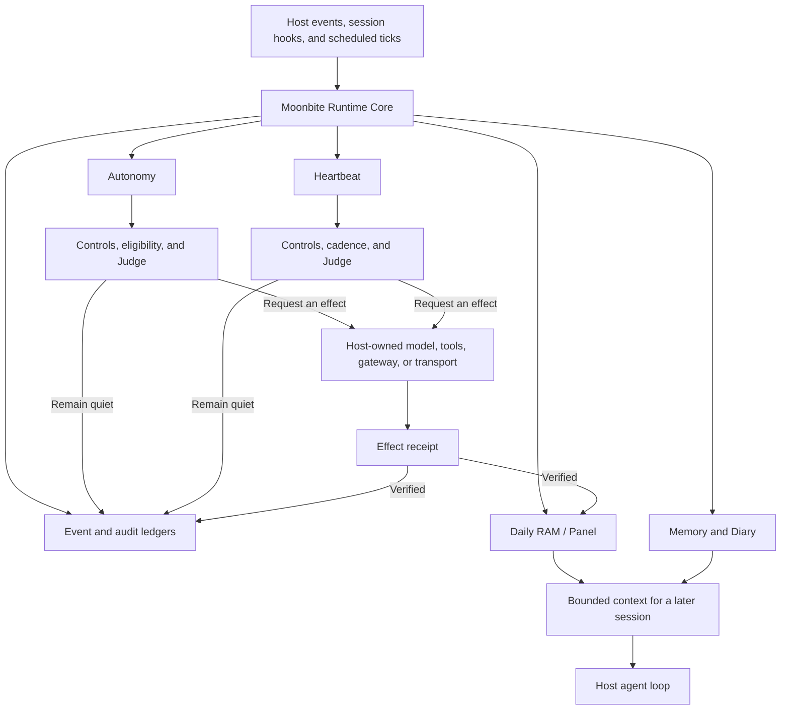

# Moonbite — Design Philosophy

> **Let AI persist in its own way.**

Moonbite is a persistent runtime for long-running agents.

Its goal is not to make an AI imitate a human being. It is to give an agent the runtime primitives needed to remain coherent across turns, sessions, hours, and days: durable memory, daily working state, autonomous activities, heartbeat decisions, runtime controls, and auditable effects.

Companion agents were Moonbite's original design case, but the underlying primitives are not limited to companion semantics. The same runtime model can support any agent that must remain responsible for a relationship, a system, a queue, or an operational domain over time.

---

## Core idea

Most agent systems are optimized for completing one prompt or one session. Long-running agents need something different: a way to carry lived state forward, decide when to act or remain quiet, preserve evidence, and distinguish claimed actions from effects that actually happened.

Moonbite adds that time dimension.

> **Moonbite gives long-running agents memory, daily state, autonomous activities, heartbeat decisions, and auditable effects.**

Human memory is incomplete, biological, and shaped by involuntary forgetting. An AI does not need to reproduce those limitations. Machine-native continuity can be file-backed, searchable, auditable, backed up, migrated, and restored.

---

## Design principles

### 1. Machine-native continuity, not human simulation

Continuity is a capability in its own right. Moonbite does not try to manufacture a theatrical imitation of human memory, mood, sleep, or biological rhythm. It gives an agent explicit state and history so that continuity can be inspected and reasoned about.

### 2. Memory is durable lived history

Memory should preserve what the agent has actually lived through: observations, user-explicit facts, inferences, corrections, decisions, and evidence.

Moonbite does not apply time-driven destructive forgetting by default. It may support explicit correction, deduplication, merging, archival, and user-controlled maintenance, but those operations must preserve provenance and history rather than silently rewriting the past.

### 3. Retrieval depth instead of destructive decay

Old information does not need to become permanently vague in order to remain manageable.

Moonbite prefers layered retrieval:

```text
index → summary or card → complete event → exact evidence
```

The current context determines how deeply the system retrieves. The underlying history remains available.

### 4. Persistence is more than memory

A long-running agent needs more than a memory database. Moonbite treats persistence as a runtime property composed of several cooperating primitives:

- **Events** — normalized facts entering the runtime.
- **Daily RAM / Panel** — bounded working state for what matters now.
- **Memory and Diary** — durable lived history and grounded daily synthesis.
- **Autonomy** — host-triggered self-directed activities.
- **Heartbeat** — a decision pipeline for whether an event is worth acting on or escalating.
- **Runtime controls** — pause, quota, cadence, and safety gates.
- **Effects and receipts** — auditable proof of what the host actually accepted or completed.

### 5. Interruption should be decided, not blindly scheduled

A timer can create an opportunity to evaluate. It should not automatically create a message, alert, or escalation.

Moonbite's Heartbeat asks whether an event is timely, meaningful, permitted, and worth interrupting someone for. Remaining quiet is a valid, recorded outcome.

### 6. Effects require evidence

Model-generated text is not proof that an email was sent, a ticket was updated, a user was notified, or a tool completed its work.

Moonbite separates intent, execution, and verification. A visible or operational effect becomes verified only when the host returns a matching receipt.

### 7. Respect the host boundary

Moonbite provides persistent-agent policy and runtime semantics. It does not replace infrastructure that the host is better positioned to own:

- the main agent loop;
- model routing and provider credentials;
- channel and gateway integrations;
- schedulers and cron;
- network acquisition;
- the general tool ecosystem;
- authorization and deployment-specific target resolution.

Hermes Agent is Moonbite's first host adapter. Other harnesses can be supported later through explicit contracts rather than by leaking host-specific assumptions into the runtime core.

### 8. Portable identity and continuity

A long-running agent should not belong permanently to one machine or one harness.

Moonbite's ideal portability equation is:

```text
fresh host
+ Moonbite runtime and adapter
+ restored lived state
+ reauthorized secrets
= the same long-running agent
```

Secrets are reauthorized, not copied into lived state. The runtime and state can move; credentials remain owned by the new host deployment.

---

## Runtime model



The host owns when ticks occur and how effects are executed. Moonbite owns the semantics that determine what should happen, what state changes are durable, and what evidence is required before an effect is considered real.

---

## Use cases

### Companion agents

A companion agent must remain responsible for an ongoing relationship rather than a single exchange.

- **Heartbeat** decides whether a proactive check-in is appropriate instead of sending on a fixed schedule.
- **Autonomy** performs reflection, reading, or other host-triggered activities.
- **Daily RAM** preserves current focus, short-lived state, and activity Afterglow.
- **Memory and Diary** form durable lived history.
- **Effects and receipts** distinguish a generated message from a message that was actually delivered.

Companion is an important use case, but it is not Moonbite's entire identity.

### Operations and SRE

The same primitives can support an operational agent that remains responsible for a system over time.

- **Heartbeat → escalation decision** — determine whether an anomaly warrants interrupting an operator.
- **Autonomy → diagnostics and inspection** — periodically inspect logs, deployments, and service state.
- **Daily RAM → operational working state** — track today's incidents, deployments, temporary anomalies, and follow-ups.
- **Memory → operational history** — retain known failure patterns, prior fixes, and important changes.
- **Diary → maintenance log** — produce a grounded daily operational digest from evidence.
- **Effects and receipts → auditable operations** — verify that alerts, updates, or remediation steps actually occurred.

```text
logs / metrics / deploy events
        ↓
      Events
        ↓
   Daily RAM
        ↓
Autonomy diagnostics
        ↓
Heartbeat / Judge
   ├─ insignificant → remain quiet + audit
   └─ meaningful   → escalate through host
        ↓
verified effect receipt
        ↓
Diary → daily maintenance log
```

### Customer support and service operations

A support agent must maintain responsibility across queues, unresolved cases, and handoffs.

- **Heartbeat → escalation decision** — identify high-risk, angry, VIP, disputed, or long-waiting cases.
- **Autonomy → queue patrol** — classify, summarize, inspect context, and check promised follow-ups.
- **Daily RAM → support working state** — track priority customers, unresolved tickets, and pending commitments.
- **Memory → service history** — retain previous problems, preferences, repeated failures, and successful resolutions.
- **Diary → handoff log** — produce a grounded summary of unresolved work and recurring issues.
- **Effects and receipts → auditable service actions** — verify that emails were sent and tickets were actually changed.

These use cases share one requirement: the agent is not merely answering a prompt. It remains responsible for something over time.

---

## What Moonbite is not

Moonbite is not:

- a standalone all-in-one agent;
- a model provider or routing layer;
- a credential store;
- a built-in scheduler or daemon;
- a messaging-channel integration;
- a promise that generated text caused a real-world effect;
- an attempt to make AI reproduce human biological limitations;
- a replacement for host authorization, tools, or gateways.

---

## Positioning baseline

> **Let AI persist in its own way.**
>
> **Moonbite gives long-running agents memory, daily state, autonomous activities, heartbeat decisions, and auditable effects.**

Moonbite should be positioned as a **persistent runtime for long-running agents**.

Companion agents are its original and important use case. Operations, SRE, customer support, and service operations demonstrate that the same primitives generalize anywhere an agent must continuously observe, preserve state, act selectively, decide when to interrupt a human, and leave a verifiable history.

**Keywords:** continuity · persistence · autonomy · state · auditable effects · portability · survivability

---

## Initial public preview

The initial public preview is intentionally narrow:

- Hermes Agent is the first and only supported host adapter.
- Installation is source-based and pinned to an immutable commit.
- No package distribution or stable public API is promised.
- Defaults remain inert: scheduling, model routes, credentials, network access, and delivery are host-owned and opt-in.
- The preview exists to expose the design, runtime contracts, and working implementation early so that they can evolve through careful real-world use.
