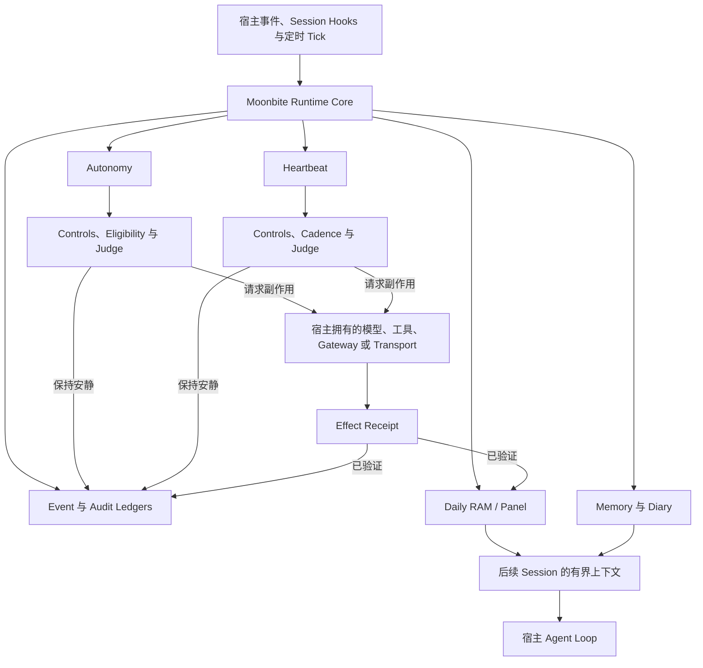

# Moonbite — 设计理念

> **Let AI persist in its own way.**
>
> **让 AI 以自己的方式持续存在。**

Moonbite 是一个面向 long-running agents 的持续性运行时（persistent runtime）。

它的目标不是让 AI 模仿人类，而是为 Agent 提供跨 turn、跨 session、跨小时与跨天持续存在和工作的运行时原语：长期记忆、每日工作状态、自主活动、Heartbeat 决策、运行时控制，以及可审计的真实副作用。

陪伴型 Agent 是 Moonbite 最初的设计场景，但这些原语并不依赖“陪伴”语义。只要一个 Agent 需要在时间上持续对某段关系、某套系统、某个队列或某项业务负责，同一套运行时模型都可以复用。

---

## 核心理念

多数 Agent 系统擅长完成一次 prompt 或一次 session。长期运行的 Agent 需要的是另一类能力：把已经经历过的状态带到未来，决定何时行动、何时保持安静，保留证据，并区分“模型声称做过”与“现实中确实发生”。

Moonbite 为 Agent 加入这个时间维度。

> **Moonbite gives long-running agents memory, daily state, autonomous activities, heartbeat decisions, and auditable effects.**

人类记忆会模糊、遗忘，并受到生物节律限制；AI 不必主动复制这些限制。机器原生的连续性可以文件化、可检索、可审计、可备份、可迁移，也可以在新的宿主上恢复。

---

## 设计原则

### 1. 机器原生的连续性，而不是人类模拟

连续性本身就是一种能力。Moonbite 不试图制造对人类记忆、情绪、睡眠或生物节律的戏剧化模仿，而是给 Agent 明确的状态和历史，使其连续性可以被观察、解释与验证。

### 2. 记忆是耐久的 lived history

记忆应当保存 Agent 真正经历过的内容：观察、用户明确表达的事实、推断、纠错、决策与证据。

Moonbite 默认不采用按时间主动销毁历史的遗忘机制。它可以支持显式纠错、去重、合并、归档和用户控制的维护，但这些操作必须保留来源与历史，不能静默重写过去。

### 3. 用检索深度替代破坏性衰减

为了控制上下文，并不需要让旧信息永久变得模糊。

Moonbite 更倾向于分层检索：

```text
索引 → 摘要或卡片 → 完整事件 → 精确 evidence
```

当前语境决定检索多深，底层历史仍然保留。

### 4. 持续性不只是记忆

长期 Agent 需要的不只是一个 memory database。Moonbite 将持续性视为多个运行时原语共同组成的能力：

- **Events** — 进入运行时的规范化事实；
- **Daily RAM / Panel** — 对“现在重要什么”的有界工作状态；
- **Memory / Diary** — 耐久的 lived history 与基于证据的每日合成；
- **Autonomy** — 由宿主 tick 触发的自主活动；
- **Heartbeat** — 判断事件是否值得行动、升级或打断人的决策流水线；
- **Runtime controls** — 暂停、配额、节奏和安全门禁；
- **Effects / receipts** — 宿主实际接受或完成副作用的可审计证明。

### 5. 打断人应当经过判断，而不是由定时器直接决定

定时器可以提供一次评估机会，但不应该自动生成消息、告警或升级。

Moonbite 的 Heartbeat 判断一个事件是否及时、重要、被允许，并且是否值得打断人。保持安静是合法且会被记录的结果。

### 6. 副作用必须有证据

模型生成了一段文字，并不能证明邮件已经发送、Ticket 已经更新、用户已经收到通知，或工具已经完成工作。

Moonbite 将意图、执行与验证分开。只有宿主返回匹配的 receipt，一个外部或可见效果才会被认定为 verified。

### 7. 尊重宿主边界

Moonbite 负责 persistent-agent 的策略与运行时语义，不重复建设更适合由宿主拥有的通用基础设施：

- 主 Agent loop；
- 模型路由与 provider credentials；
- channel / gateway；
- scheduler 与 cron；
- 网络获取；
- 通用工具生态；
- 授权与部署特定的 target resolution。

Hermes Agent 是 Moonbite 的第一个 host adapter。未来可以通过明确的 host contract 适配其他 harness，而不是把某个宿主的内部假设泄漏进 runtime core。

### 8. 可迁移的身份与连续性

长期 Agent 不应永久属于某一台机器或某一个 harness。

Moonbite 的理想迁移公式是：

```text
fresh host
+ Moonbite runtime / adapter
+ restored lived state
+ reauthorized secrets
= the same long-running Agent
```

Secrets 应当在新宿主重新授权，而不是被复制进 lived state。运行时和状态可以迁移，credentials 继续由新的宿主部署拥有。

---

## 运行机制



宿主决定 tick 何时发生，以及副作用如何执行；Moonbite 决定什么应当发生、哪些状态必须耐久保存，以及一个效果需要什么证据才能被视为真实。

---

## 使用场景

### 陪伴型 Agent

陪伴型 Agent 需要持续对一段关系负责，而不是只完成一次对话。

- **Heartbeat** 判断是否适合主动联系，而不是固定频率打扰；
- **Autonomy** 执行反思、阅读或其他宿主触发的活动；
- **Daily RAM** 保存当前关注点、短期状态和活动 Afterglow；
- **Memory / Diary** 形成耐久的 lived history；
- **Effects / receipts** 区分“生成了一条消息”和“消息真的送达”。

Companion 是重要用例，但不是 Moonbite 的全部身份。

### Operations / SRE

同一套原语可以支持一个长期负责系统运行的运维 Agent。

- **Heartbeat → escalation decision**：判断异常是否值得立即打断操作员；
- **Autonomy → diagnostics / inspection**：周期性检查日志、部署和服务状态；
- **Daily RAM → operational working state**：保存当天事故、部署、临时异常和待跟踪事项；
- **Memory → operational history**：积累已知故障模式、历史修复和重要变更；
- **Diary → maintenance log**：基于 evidence 生成每日维护摘要；
- **Effects / receipts → auditable operations**：验证告警、更新或修复是否真实发生。

```text
logs / metrics / deploy events
        ↓
      Events
        ↓
   Daily RAM
        ↓
Autonomy diagnostics
        ↓
Heartbeat / Judge
   ├─ insignificant → remain quiet + audit
   └─ meaningful   → escalate through host
        ↓
verified effect receipt
        ↓
Diary → daily maintenance log
```

### Customer Support / Service Ops

客服 Agent 需要跨队列、未解决工单和交接持续负责。

- **Heartbeat → escalation decision**：识别愤怒客户、退款争议、VIP、高风险或长时间未回复的 case；
- **Autonomy → queue patrol**：分类、摘要、补查上下文和检查已承诺 follow-up；
- **Daily RAM → support working state**：保存当天重点客户、未解决工单与待完成承诺；
- **Memory → service history**：积累过去问题、偏好、重复故障和有效解决方案；
- **Diary → handoff log**：生成有证据支撑的未解决事项与高频问题摘要；
- **Effects / receipts → auditable service actions**：验证邮件真的发送、Ticket 真的被修改。

这些场景的共同点是：Agent 不只是回答一个 prompt，而是在时间上持续对某个对象负责。

---

## Moonbite 不是什么

Moonbite 不是：

- 一个独立、全能的一体化 Agent；
- 模型提供商或路由层；
- 凭据存储；
- 内置 scheduler 或 daemon；
- 即时通讯渠道集成；
- 对“模型说已经执行”的盲目信任；
- 让 AI 复制人类生物限制的尝试；
- 对宿主授权、工具或 gateway 的替代。

---

## 定位基线

> **Let AI persist in its own way.**
>
> **Moonbite gives long-running agents memory, daily state, autonomous activities, heartbeat decisions, and auditable effects.**

Moonbite 应被定位为：**persistent runtime for long-running agents**。

陪伴型 Agent 是它最初且重要的使用场景；Operations、SRE、Customer Support 与 Service Ops 说明了这些运行时原语可以自然推广到任何需要 Agent 持续观察、保存状态、自主行动、决定何时打断人，并留下可验证历史的场景。

**关键词：** continuity · persistence · autonomy · state · auditable effects · portability · survivability

---

## 初始公开预览

初始 public preview 会刻意保持狭窄：

- Hermes Agent 是第一个、也是当前唯一正式支持的 host adapter；
- 采用锁定不可变 Commit 的源码安装；
- 暂不发布 Package，也不承诺稳定 public API；
- 默认行为保持 inert：调度、模型路由、credentials、网络访问与 delivery 全部由宿主拥有并显式启用；
- Preview 的目标是尽早公开设计、运行时契约和可工作的实现，在真实使用中谨慎演进。
